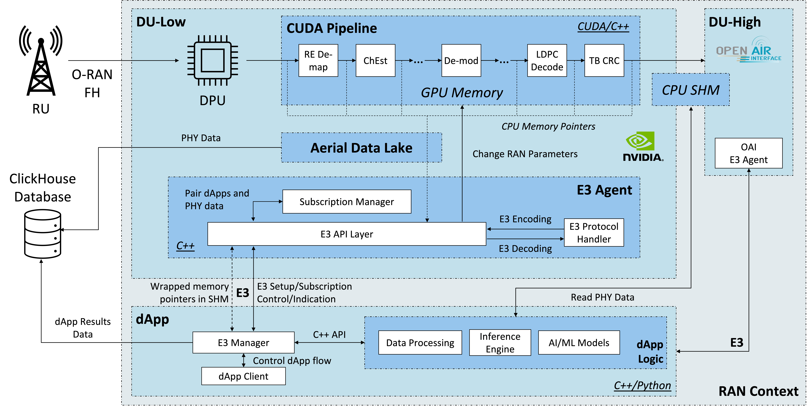
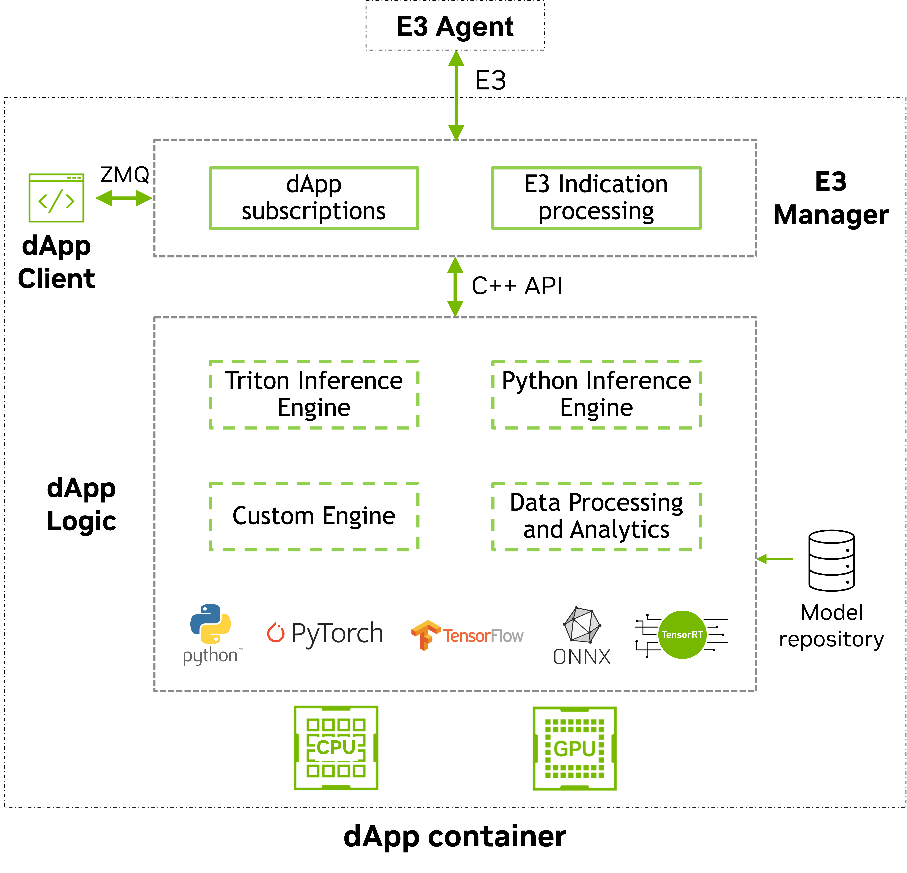

# dApps Framework

Real-time RAN data processing framework using a pre-standard version of the E3 interface and E3 Application Protocol (E3AP). The E3 Manager orchestrates data flow between E3 Agents (NVIDIA Aerial cuBB L1, OpenAirInterface L2, or other E3-compliant components) and pluggable application logic (inference engines, data analytics, custom processing).

## Project Structure

```
.
├── common/                             # Shared core (engine-agnostic)
│   ├── e3_manager/                     # E3 Manager: E3AP protocol, multi-agent, shared memory
│   └── client/                         # dApp client scripts for testing and control
├── applications/                       # Individual dApp Logic implementations
│   ├── prb-power-python/              # PRB Power dApp with embedded Python
│   ├── prb-power-triton/              # PRB Power dApp with Triton C API
│   └── prb-power-triton-grpc/         # PRB Power dApp with Triton gRPC
└── docs/                               # E3 protocol documentation and schemas
```

## Architecture

The system consists of three main components:

- **E3 Manager** (`common/e3_manager/`): Core engine handling E3AP protocol, multi-agent communication, shared memory, and application dispatch. The inference engine is pluggable via the `InferenceEngine` abstract interface (e.g., embedded Python, Triton C API, Triton gRPC).

- **dApp Client** (`common/client/`): External control interface for managing the dApp lifecycle: listing agents, subscribing to telemetry, unsubscribing, and querying status.

- **dApp Logic** (`applications/`): Self-contained dApp combining an inference engine with application-specific processing logic (e.g., PRB power calculation). Each app has its own config, Dockerfile, models, and build system. See the [applications README](applications/) for available dApps and performance benchmarks.

### Architecture Diagrams

<div align="center">
  <br>
  <em>High-level dApp architecture</em>
</div>
<br>
<div align="center">
  <br>
  <em>dApp reference implementation</em>
</div>

## Available Data Streams

The E3 Agent exposes the following uplink data streams through the NVIDIA KPM Service Model. dApps can subscribe to any combination of these to receive real-time RAN data for inference, analytics, or custom processing.

| Category | Data | Description |
|----------|------|-------------|
| IQ & Channel | IQ samples, DMRS estimates, PUSCH data | Raw fronthaul IQ, DMRS channel estimates, decoded PUSCH (shared memory) |
| Frame info | SFN, Slot, Timestamp | System Frame Number, slot index, agent-side nanosecond timestamp |
| Cell & Antenna | Cell ID, RX antennas, BS antennas, Cells | Physical cell ID, antenna counts |
| Channel quality | RSRP, RSSI, CQI, MCS index, QAM order | PHY-layer measurements and modulation parameters |
| PUSCH | TB CRC fail, CB errors, CB count | Transport/code block error indicators |
| Resource allocation | RB start, RB size, Symbols, Subcarriers, MIMO layers | Frequency/time resource assignment |
| SRS | SRS IQ, SRS channel estimates, per-RB SNR, SRS data | Uplink SRS samples, per-UE channel estimates, and per-band SNR |

This list reflects the currently supported telemetry streams. Additional data streams and service models may be added in future releases. See `docs/application_development_guide.md` for the full per-field telemetry ID table and shared memory layout details.

## Quick Start

### 1. Start the gNB

Start the gNB with E3 Agent capabilities (e.g., cuBB with `data_core` and `e3_agent_enable` options enabled in the cuphycontroller YAML) and connect a UE.

> **Note:** The [E3 Agent Standalone](https://github.com/NVIDIA/aerial-cuda-accelerated-ran/tree/main/cuPHY-CP/e3agent-standalone) tool allows the E3 Agent to run without a full RAN, feeding it synthetic or replayed telemetry. The dApp side is identical, so logic developed there runs unchanged against a live L1.

### 2. Build and Run

```bash
# Embedded Python (easiest to develop)
cd applications/prb-power-python && ./restart_script.sh

# Triton C API (lowest latency)
cd applications/prb-power-triton && ./restart_script.sh

# Triton gRPC
cd applications/prb-power-triton-grpc && ./restart_script.sh
```

> **Note:** The default config assumes the cuBB container is named `nv-cubb`. If your container name differs, update `ipc_mode` in `config/e3_config.json` (e.g., `"container:my-cubb-container"`).

### 3. Subscribe to Data and Run Application Logic

From another terminal, run the end-to-end test to subscribe to telemetry streams (note that `prb-power-python` auto-subscribes on startup by default, while the triton variants do not, since they serve multiple models):

```bash
docker exec -it dapp-prb-power-triton \
    /opt/src/common/client/e3_e2e_test.py \
    -a NVIDIA_L1 -m prb_power_numpy -t 1,4,5,6 -d 10
```

This subscribes to IQ samples (1), SFN (5), slot (6), and timestamp (4) from agent `NVIDIA_L1`, waits 10 seconds while the dApp runs inference, then unsubscribes and verifies cleanup.

Expected output:

```
  ✓ Agent listing PASSED
  ✓ Initial status check PASSED
  ✓ Subscription request sent
  [PRB Power Triton] SFN/Slot: 123/4 Inference successful. Latency: 1197us
  ✓ Subscription delete request sent
  ✓ Status shows no agent is subscribed
  --- Test Complete ---
```

Use `-i` for interactive mode (press Enter to advance each step). Run with `--help` for all options.

| Option | Default | Description |
|--------|---------|-------------|
| `-a, --agent` | (required) | E3 Agent name (e.g., `NVIDIA_L1`) |
| `-m, --model` | `prb_power_numpy` | Inference model name |
| `-t, --telemetry-ids` | `1,4,5,6` | Comma-separated telemetry IDs |
| `-r, --ran-function-id` | `2` | RAN Function Identifier |
| `-p, --periodicity` | `100000` | Indication interval in microseconds |
| `-d, --duration` | `5` | Seconds to wait before sending subscription delete |
| `-s, --subscription-time` | `0` | Server-side subscription TTL (seconds, 0=indefinite) |
| `-i, --interactive` | off | Step-by-step mode with prompts |

For individual dApp operations (check status, subscribe, unsubscribe, setup, release), use `e3_client.py`. With per-agent `auto_setup: true` (default), setup runs automatically on startup and after a reconnect; an agent can also set `subscription_options.auto_subscribe` to subscribe on its own, with no client required. See the [Application Development Guide](docs/application_development_guide.md#testing-and-client-tools) for the full command reference.

## Documentation

Technical documentation is available in `docs/`:

- **[application_development_guide.md](docs/application_development_guide.md)**: How to build a new dApp application
- **[e3_message_schemas.json](docs/e3_message_schemas.json)**: E3AP and E3SM message schemas (JSON Schema format)
- **[e3_message_examples.json](docs/e3_message_examples.json)**: Example messages and client commands
- **[data_representation.md](docs/data_representation.md)**: Shared memory data layout for PUSCH and SRS data streams (e.g., IQ and H estimates)

## License and Citation

This project is licensed under the Apache 2.0 license. See the LICENSE file for details.

If you use this software in your research, please cite:

```bibtex
@article{nvidia2026dapps,
    title = {{Programmable and GPU-Accelerated Edge Inference for Real-Time ISAC on NVIDIA Aerial Testbed}},
    author = {Villa, Davide and Belgiovine, Mauro and Hedberg, Nicholas and Polese, Michele and Dick, Chris and Melodia, Tommaso},
    journal = {arXiv:2512.06493 [cs.NI]},
    year = {2026}
}
```

## References

[1] **NVIDIA dApp Framework:** D. Villa, M. Belgiovine, N. Hedberg, M. Polese, C. Dick, and T. Melodia, "Programmable and GPU-Accelerated Edge Inference for Real-Time ISAC on NVIDIA Aerial Testbed," arXiv:2512.06493 \[cs.NI\], 2026. [arXiv PDF](https://arxiv.org/pdf/2512.06493)

[2] **dApps Concept:** S. D'Oro, M. Polese, L. Bonati, H. Cheng, and T. Melodia, "dApps: Distributed Applications for Real-time Inference and Control in O-RAN," *IEEE Communications Magazine*, 2022. [arXiv PDF](https://arxiv.org/pdf/2203.02370.pdf)

[3] **O-RAN nGRG First Research Report:** Northeastern University, NVIDIA, Mavenir, MITRE, and Qualcomm, "dApps for Real-Time RAN Control: Use Cases and Requirements," *O-RAN next Generation Research Group (nGRG)*, Research Report, Oct 2024, report ID: RR-2024-10. [Report PDF](https://mediastorage.o-ran.org/ngrg-rr/nGRG-RR-2024-10-dApp%20use%20cases%20and%20requirements.pdf)

[4] **O-RAN nGRG Second Research Report:** Northeastern University, SoftBank, NVIDIA, "dApps Architecture and Interfaces," *O-RAN next Generation Research Group (nGRG)*, Research Report, 2025, report ID: RR-2025-05, v2.0. [Report PDF](https://mediastorage.o-ran.org/ngrg-rr/nGRG-RR-2025-05-dApps%20Architecture%20and%20Interfaces-v2.0.pdf)

[5] **E3 Interface:** A. Lacava, L. Bonati, N. Mohamadi, R. Gangula, F. Kaltenberger, P. Johari, S. D'Oro, F. Cuomo, M. Polese, and T. Melodia, "dApps: Enabling Real-Time AI-Based Open RAN Control," *Computer Networks*, vol. 269, pp. 111342, 2025. [ScienceDirect](https://www.sciencedirect.com/science/article/pii/S1389128625003093)

[6] NVIDIA Corporation, "Aerial CUDA-Accelerated RAN," GitHub. [GitHub repo](https://github.com/NVIDIA/aerial-cuda-accelerated-ran)

[7] NVIDIA Corporation, "Aerial Testbed," NVIDIA Developer Documentation. [NVIDIA Docs](https://docs.nvidia.com/aerial/testbed/latest/index.html)
