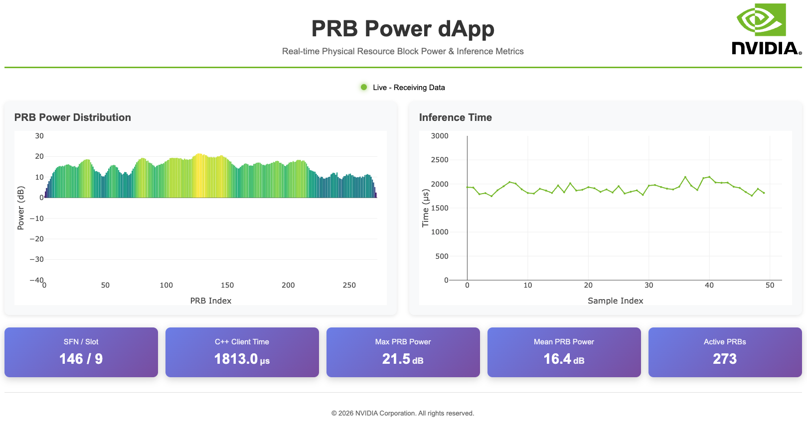

# PRB Power dApp (Triton C API)

Real-time PRB power calculation from IQ samples using the [Triton Inference Server C API](https://docs.nvidia.com/deeplearning/triton-inference-server/user-guide/docs/customization_guide/inprocess_c_api.html). The dApp receives RAN data via E3 from an E3 Agent, runs inference through Triton (in-process, no gRPC/HTTP), and optionally publishes results via ZMQ for visualization. All models are generated at startup and loaded into the Triton server before the E3 Manager begins processing.

## Directory Structure

```
.
├── config/e3_config.json          # Runtime configuration
├── prb_power_app.cpp              # Application entry point and handler
├── triton_integration/            # Triton inference engine implementation
│   ├── triton_engine.h
│   └── triton_engine.cpp
├── models/                        # Triton model repository
│   ├── prb_power_numpy/
│   └── prb_power_torch/
├── scripts/                       # Model creation and management tools
├── visualizer/                    # PRB power web visualizer
├── CMakeLists.txt                 # Build configuration
├── Dockerfile                     # Container definition
├── compose.yml                    # Docker Compose configuration
├── start_services.sh              # Service startup script
└── restart_script.sh              # Container rebuild and restart
```

## Quick Start

### 1. Configure

Edit `config/e3_config.json`:
- Set `deployment.ipc_mode` to match your cuBB container name (e.g., `container:nv-cubb`)
- Set `e3_manager.e3_agents[].host` and ports to match your E3 Agent
- Set `e3_manager.default_model` to the desired inference model

### 2. Build and Run

```bash
./restart_script.sh
```

This builds the container and starts:
- Triton Inference Server (in-process via C API)
- Model generation (NumPy, PyTorch, LibTorch, ONNX, TensorRT)
- E3 Manager with the PRB Power application handler
- dApp client interface on port 5558

If `auto_setup` is enabled in the config (default: `true`), the E3 Manager will automatically connect to all enabled agents and open the shared memory region on startup.

### 3. Subscribe to Data

From another terminal:

```bash
docker exec -it dapp-prb-power-triton \
    /opt/src/common/client/e3_e2e_test.py \
    -a NVIDIA_L1 -m prb_power_numpy \
    -r 2 -t 1,4,5,6 -p 100000 -d 10
```

This subscribes to IQ samples (1), timestamp (4), SFN (5), and slot (6) from agent `NVIDIA_L1` using the `prb_power_numpy` model and RAN Function ID 2 (`-r 2`, NVIDIA KPM), requesting indications every 100ms (`-p 100000`) for 10 seconds (`-d 10`).

Run the script with `--help` for full options and telemetry ID reference. See the [Application Development Guide](../../docs/application_development_guide.md) for interactive mode and granular control via `e3_client.py`.

## Configuration

The `config/e3_config.json` file controls all runtime settings:

```json
{
  "deployment": {
    "ipc_mode": "container:nv-cubb",
    "shared_memory": {
      "key": "/e3_ran_buffers",
      "required": true
    }
  },
  "application": {
    "name": "PRB Power Triton",
    "version": "1.0.0",
    "vendor": "NVIDIA",
    "results_pub_port": 5559,
    "enable_results_publishing": true
  },
  "e3_manager": {
    "dapp_client_endpoint": "tcp://*:5558",
    "e3_agents": [
      {
        "name": "NVIDIA_L1",
        "host": "127.0.0.1",
        "agent_rep_port": 5555,
        "agent_pub_port": 5556,
        "agent_sub_port": 5557,
        "enabled": true
      }
    ],
    "default_model": "prb_power_numpy",
    "auto_setup": true,
    "subscription_response_timeout_s": 10,
    "debug_enabled": false
  },
  "triton": {
    "model_repository": "/models",
    "startup_timeout_seconds": 30
  }
}
```

**Key settings:**

| Section | Field | Description |
|---------|-------|-------------|
| `deployment` | `ipc_mode` | Docker IPC namespace. Set to `container:<cubb-container-name>` to share memory with cuBB (default: `nv-cubb`). |
| `deployment` | `shared_memory.key` | POSIX shared memory identifier (must match cuBB). |
| `deployment` | `shared_memory.required` | `true`: retry until SHM available. `false`: start without, attempt once. |
| `e3_manager` | `e3_agents[].host` | E3 Agent IP address. Must match the agent's ZMQ bind address. |
| `e3_manager` | `e3_agents[].agent_rep_port` | Agent REP port: dApp sends setup request, Agent replies. |
| `e3_manager` | `e3_agents[].agent_pub_port` | Agent PUB port: Agent publishes indications, dApp subscribes. |
| `e3_manager` | `e3_agents[].agent_sub_port` | Agent SUB port: dApp publishes subscribe/unsubscribe/control/release, Agent subscribes. |
| `e3_manager` | `auto_setup` | Automatically run E3 setup on startup. |
| `e3_manager` | `debug_enabled` | Print all indication metadata and raw IQ/H-estimate debug data. Can also be enabled via `--debug` CLI flag. |
| `application` | `results_pub_port` | ZMQ port for publishing inference results (used by visualizer). |
| `triton` | `model_repository` | Path to the Triton model repository. |

## Models

### Included Models

| Model | Triton Backend | Device | Description |
|-------|---------------|--------|-------------|
| `prb_power_numpy` | Python | CPU | PRB power using NumPy |
| `prb_power_torch` | Python | GPU | PRB power using PyTorch with CUDA |
| `prb_power_libtorch` | PyTorch (LibTorch) | GPU | PRB power using TorchScript (native C++ backend) |
| `prb_power_onnx` | ONNX Runtime | GPU | PRB power using ONNX Runtime (native C++ backend) |
| `prb_power_trt` | TensorRT | GPU | PRB power using TensorRT (native C++ backend) |

`prb_power_numpy` and `prb_power_torch` are included in the model repository. The remaining models are generated at startup by the scripts in `scripts/`.

### Model Management

All models are generated and loaded at startup by `start_services.sh`. To change which models are loaded, edit `start_services.sh`.

To check model status:

```bash
docker exec -it dapp-prb-power-triton bash
cd /opt/src/applications/prb-power-triton
python3 scripts/triton_loader.py -s
```

> **Note:** Runtime load/unload requires the gRPC variant ([prb-power-triton-grpc](../prb-power-triton-grpc/)).

### Model Generation Scripts

These scripts generate models that use Triton's native C++ backends (no Python overhead at inference time):

```bash
# LibTorch backend (prb_power_libtorch)
python3 scripts/create_libtorch_model.py

# ONNX Runtime backend (prb_power_onnx)
python3 scripts/create_onnx_model.py

# TensorRT backend (prb_power_trt)
python3 scripts/create_trt_model.py
```

Each script creates a complete Triton model repository under `/models/`. All are run automatically at startup.

For converting existing ONNX models:

```bash
# Analyze model structure
python3 scripts/onnx_analyzer_arm.py -i model.onnx -a

# Create Triton repository from ONNX
python3 scripts/onnx_analyzer_arm.py -i model.onnx -n my_model -o /models

# Convert to TensorRT with FP16 precision
python3 scripts/onnx_analyzer_arm.py -i model.onnx -n my_model -o /models -t -p fp16
```

## Visualizer

Real-time web-based visualization of PRB power distribution and inference timing. Connects to the E3 Manager's ZMQ results publisher to display live PRB power data from models like `prb_power_numpy` and `prb_power_torch`.

```bash
docker exec -it dapp-prb-power-triton bash /opt/src/applications/prb-power-triton/visualizer/start_prb_visualizer.sh
```

Open browser to `http://localhost:5001`.

**Options:**
- `--port`: Web server port (default: 5001)
- `--zmq-port`: ZMQ subscriber port (default: 5559)

Example output:

```
ZMQ receiver connected to localhost:5559
Waiting for PRB power data...
[PRB] SFN: 123, Slot: 4, Max Power: 0.542 at PRB 156, Mean: 0.023
[TIMING] Total: 145.3 μs
[PRB] SFN: 123, Slot: 5, Max Power: 0.538 at PRB 156, Mean: 0.023
[TIMING] Total: 142.1 μs
```

**Features:**
- Bar chart of power distribution across all 273 PRBs
- 2D heatmap grid visualization (21x13)
- Time-series plots of mean/max power and inference latency
- Live statistics: inference time, max/mean PRB power, active PRBs, frames processed

<div align="center">
  <br>
  <em>Real-time PRB power distribution and inference timing visualization</em>
</div>

## References

- [Triton Inference Server documentation](https://docs.nvidia.com/deeplearning/triton-inference-server/user-guide/docs/introduction/index.html)
- [Triton C API (In-Process)](https://docs.nvidia.com/deeplearning/triton-inference-server/user-guide/docs/customization_guide/inprocess_c_api.html)

---
